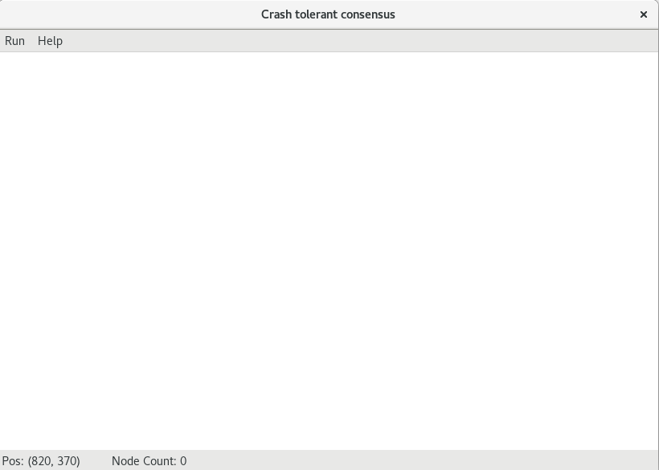
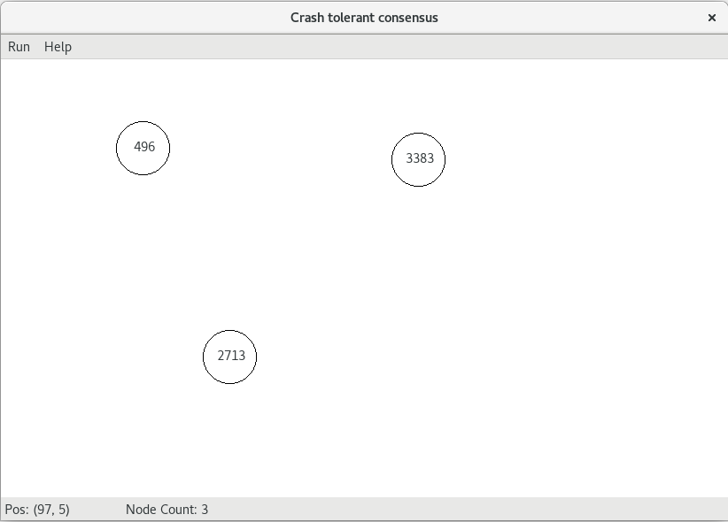
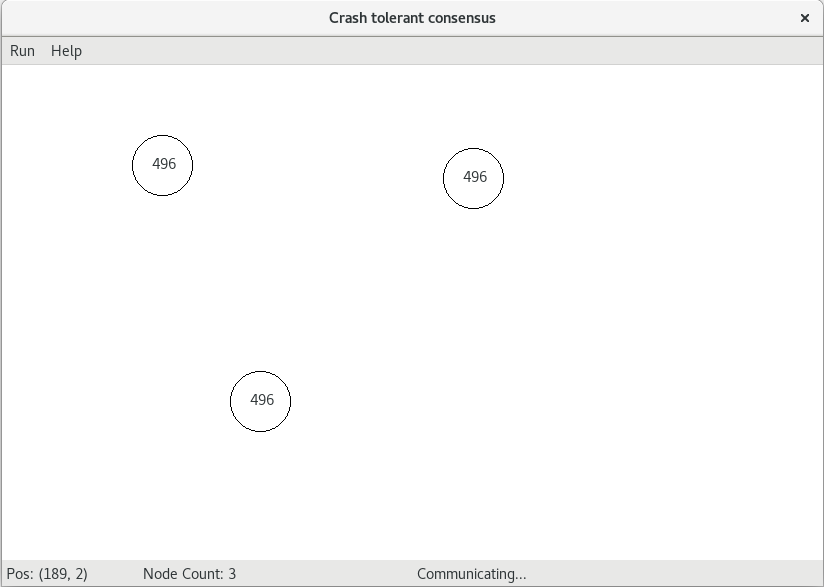

# Crash tolerant consensus

This app is used to simulate how crash tolerant consensus works with f-resilient algorithm.

## Usage

Input the following command in the terminal to launch the app.

` python MainWindow.py ` 

Click on the blank of the window to create a node with random value which represent a thread with a ip address wishing to reach a consensus with the others.

When finished creating nodes, click the "Run" on the menubar and then start communicating.

The statusbar on the bottom right displays "Communicating"...

After several seconds, all the nodes reach agreement with exactly the same value.

## Copyright

Haimin Luo, Chao Dong, Jinhui Zhu from HUST CS, Wuhan, China, 2018 Jan

Any question please contact huieric2015@gmail.com or huieric@hust.edu.cn.

Thanks.